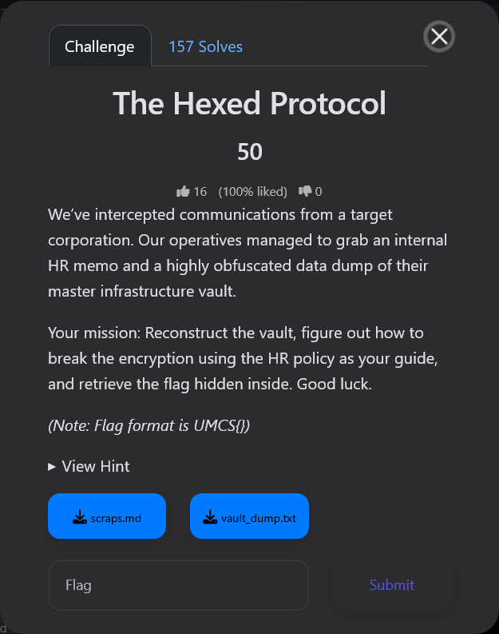
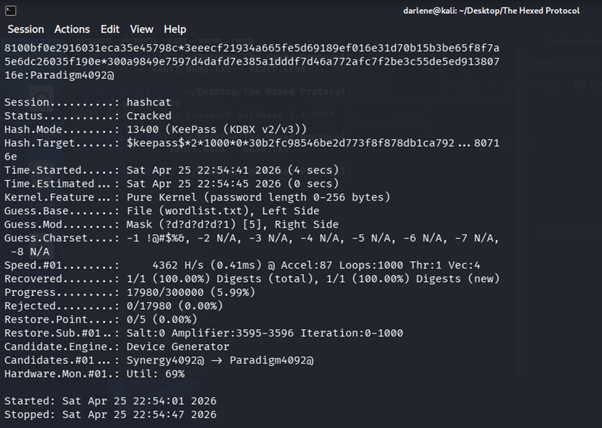
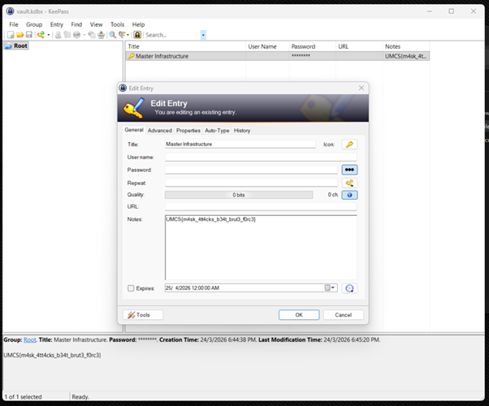
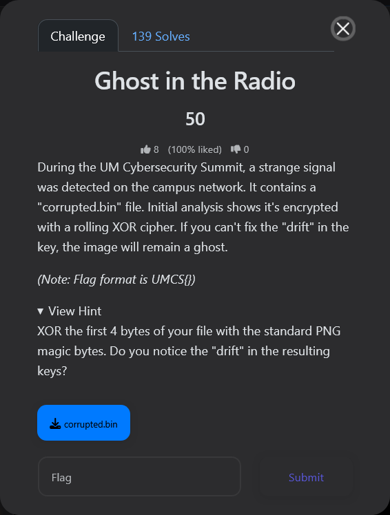
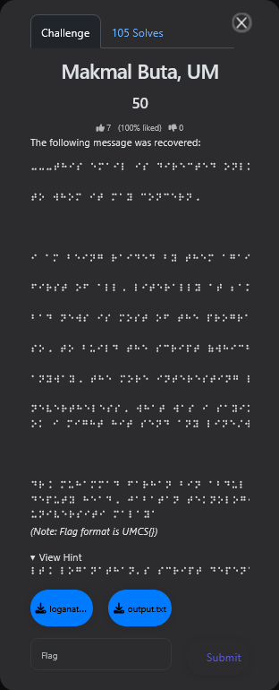
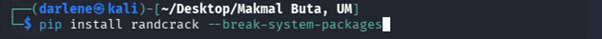
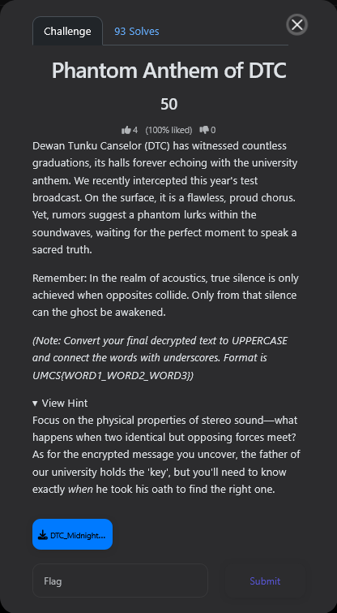
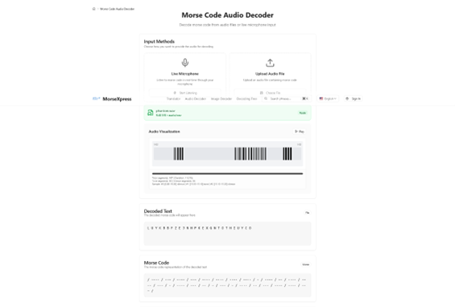
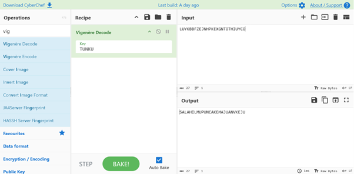

## Introduction 👋

[**Universiti Malaya Cybersecurity Summit 2026 (UMCS 2026)**](https://umcybersec.site/) is the that competition followed a Jeopardy-style Capture The Flag (CTF) format, featuring multiple categories including **Web Exploitation**, **Cryptography**, **Reverse Engineering**, **Digital Forensics**, **Binary Exploitation**, and **Miscellaneous** challenges.

I participated in this competition Online Preliminary Round as part of Team ```error404-1``` alongside my teammates ```XNerk4717``` and ```zahs7535```. By the end of the preliminary round, I successfully solved **four Cryptography challenges**.

> [!NOTE]+ 📢 Note
> I am still fairly new to writing formal CTF write‑ups, so I am actively working to improve my style and clarity. If you spot any mistakes or have suggestions, feel free to reach out.

---

## 1️⃣ [CRYPTOGRAPHY] The Hexed Protocol






We were given:   
- A hex-encoded vault dump ```vault_dump.txt```
- An HR memo ```scraps.md``` describing password policy 
- A hint suggesting a mask attack instead of brute force.   



Reconstruct the vault, recover the password, and extract the flag.



`UMCS{m4sk_4tt4cks_b34t_brut3_f0rc3}`




### **STEP 1 -- Identify the Data Format** 


The provided dump in ```vault_dump.txt``` begins with ```03d9a29a67fb4bb5...```. This is not plaintext or a standard ciphertext format. It is hex-encoded binary data. Given the challenge context “vault” and structure, this suggests a password manager database. After decoding using an AI, it matches the signature of a **KeePass KDBX database**.   

### **STEP 2 -- Convert Hex to Binary** 


The dump must first be converted into a usable binary file. In this case we use Kali Linux. The output will be a kdxb file which is a **KeePass password database 2.x KDBX**.   

### **STEP 3 -- Extract Hash** 


To extract the hash, we could use below linux terminal instrction.

Use keepass2john to extract the cracking hash: 
```
keepass2john vault.kdbx > hash.txt
```

Clean the hash: 
```
cut -d ':' -f2- hash.txt > clean_hash.txt
```

### **STEP 4 -- Analyze Password Policy** 


From the HR memo:
```
[Core Company Value] + [4-Digit Department PIN] + [One Special Character]
```

Core values:
```
SYNERGY, DISRUPTION, PIVOT, AGILITY, PARADIGM
```

Constraint:
```
Only capitalize the first letter
```

### **STEP 5 -- Crack with Hashcat**



Run below command in Kali Linux Terminal:
```
“hashcat -m 13400 clean_hash.txt wordlist.txt -a 6 '?d?d?d?d?1' -1 '!@#$%&'”
```

As you can see, the recovered password for the ```vault.kdbx``` is ```Paradigm4092@```.


### **STEP 6 -- Open the Vault with KeePass Password Safe**



Open the ```vault.kdbx``` file using KeePass PassWord Safe which is a Password Manager with ```Paradigm4092@``` as password. The Flag ```UMCS{m4sk_4tt4cks_b34t_brut3_f0rc3}``` was revealed as one of the entries notes.   

---

## 2️⃣ [CRYPTOGRAPHY] Ghost on the Radio





We are given a file named ```corrupted.bin``` and told that:
- It is encrypted using a rolling XOR cipher
- The encryption key suffers from a “drift”
- The data likely corresponds to a PNG image
- Hint provided is ```XOR the first 4 bytes with standard PNG magic bytes```
- PNG files always begin with the signature ```89 50 4E 47 0D 0A 1A 0A```  



Recover the original PNG image by reversing a drifting XOR encryption and extract the hidden flag from the decrypted file. 



`UMCS{XOR_M4G1C_BYT3S}`




### **STEP 1 -- Initial Analysis**


In above figure, we can see the first bytes of the file. Focus on the first 4 bytes which is ```cb 13 0a 02```. 

### **STEP 2 — Recovering the Initial Keystream**

| Corrupted   | PNG Magic   | XOR Result   |
| ----------- | ----------- | ------------ |
| CB          | 89          | 42           |
| 13          | 50          | 43           |
| 0A          | 4E          | 44           |
| 02          | 47          | 45           |

Table above shows XORed the first 4 bytes with the PNG magic header.

Resulting keystream:
```
42 43 44 45
```

ASCII interpretation:
```
B C D E
```

### **STEP 3 -- Key Insight of Detecting the Drift**

The recovered keystream forms a sequential pattern:
```
B → C → D → E
```

This strongly suggests that the XOR key is incrementing over time (not repeating cyclically). Thus, instead of a fixed repeating key, the cipher uses a linearly drifting keystream:
```
key[i] = 0x42 + i
```

This aligns perfectly with the challenge hint describing a "drift".


### **STEP 4 -- Decryption Approach**

Reconstruct the plaintext by applying XOR with the evolving key using below python scripts. Below Python Scripts were saved as ```solve.py```.
```
with open("corrupted.bin", "rb") as f:
    data = f.read()

decoded = bytearray()

for i in range(len(data)):
    key = (0x42 + i) & 0xff
    decoded.append(data[i] ^ key)

with open("fixed.png", "wb") as f:
    f.write(decoded)
```

After running ```solve.py``` python scripts, PNG image ```fixed.png``` appears and the image will reveal the flag for the challenge which is ```UMCS{XOR_M4G1C_BYT3S}``` as shown in below Figures.


---

## 3️⃣ [CRYPTOGRAPHY] Makmal Buta, UM






- The challenge description and hints were originally provided entirely in Braille, which I first had to translate to readable text to understand the context using the Braille Translator.
- We are given two files: a text log ```output.txt``` and a partially corrupted Python script ```loganathan_translated_to_py3.py```.
- The translated description mentions a script outputting values and then stopping after a long time. The log file contains a long sequence of exactly 626+ 32-bit hex IDs.
- The corrupted Python script outlines a process with a ```.submit``` method, predicting values, and an XOR (^) operation for decryption.
- The challenge hinges on a well-known vulnerability in Python’s default PRNG (Pseudo-Random Number Generator), which uses the Mersenne Twister (MT19937) algorithm.
  



- Recover the hidden room number by using the first 624 plaintext outputs to clone the internal state of the Mersenne Twister PRNG.
- Predict the subsequent random numbers and reverse the XOR encryption on the remaining outputs to extract the hidden flag. 



`UMCS{NMBRXD3}`




### **STEP 1 -- Initial Analysis & Translation**


In above figure, by reviewing the ```output.txt``` file, we saw hundreds of log entries, each attached to a 32-bit hex ID (e.g., 0x75ae1757). Looking at the corrupted ```loganathan_translated_to_py3.py``` script, we pieced together the following clues:

- A loop intended to iterate over a range, followed by a .submit method.
- Another loop attempting to decrypt a room_number by generating a predicted value and using the XOR bitwise operator (^).
- In cryptography, observing exactly 624 continuous 32-bit integer outputs is the magic threshold required to completely clone the internal state of the MT19937 Mersenne Twister PRNG.

This confirmed we needed to use the **randcrack Python library** to exploit the PRNG and reverse the XOR cipher.

### **STEP 2 -- Setting Up the Environment**



Because modern Kali Linux uses a defensively managed Python environment (PEP 668), a standard pip install randcrack results in an externally-managed-environment error. To quickly bypass this for the sake of the CTF, we used the override flag to install the required cracking library.

### **STEP 3 -- Developing the Exploit Script**

```
import re
from randcrack import RandCrack

def solve():
    # Read the log file
    with open("output.txt", "r") as f:
        content = f.read()
    
    # Extract all 32-bit hex IDs
    ids = re.findall(r"ID: (0x[0-9a-fA-F]{8})", content)
    
    # Initialize the Mersenne Twister cracker
    rc = RandCrack()
    
    # Feed the first 624 outputs to clone the RNG state
    for i in range(624):
        rc.submit(int(ids[i], 16))
        
    # The remaining IDs are our XOR-encrypted flag
    encrypted = ids[624:]
    room_number = ""
    
    # Predict the next numbers and XOR them with the encrypted data
    for x in encrypted:
        predicted = rc.predict_getrandbits(32)
        decrypted_char = chr(int(x, 16) ^ predicted)
        room_number += decrypted_char

    return room_number

if __name__ == "__main__":
    flag = solve()
    print(f"Recovered Room Number / Flag: {flag}")
```

With the logic mapped out, we wrote a Python script ```solve.py``` to properly implement the randcrack exploit based on the corrupted file's structure:

- **Regex Parsing:** We used the ```re``` module to extract all hex IDs from ```output.txt``` into an array.
- **Feeding the Cracker:** We initialized ```RandCrack()``` and fed the first 624 extracted hex IDs (converted to integers) into the ```submit()``` method. This successfully cloned the PRNG's state.
- **Decrypting the Flag:** For all IDs at index 624 and beyond, we generated the expected 32-bit integer using ```predict_getrandbits(32)```. We then XORed this predicted integer against the encrypted hex ID and cast it back to an ASCII character (chr()) to build the flag.  

### **STEP 4 — Execution & Flag Recovery**


As seen in above figure, running our exploit script ```solve.py``` instantly processed the 624 seeds, synchronized with the PRNG's original state, and correctly decrypted the remaining sequence to reveal the flag which is ```UMCS{NMBRXD3}```.

---

## 4️⃣ [CRYPTOGRAPHY] Phantom Anthem of DTC






We were given:
- A stereo WAV audio file: ```DTC_Midnight.wav```.
- A story hinting at hidden messages within soundwaves.
- Explicit clues about stereo sound, opposing forces, and silence.
- A cryptographic hint referring to the **"father of the university"** and **"exactly when he took his oath"**.




- Extract the hidden message embedded in the audio.
- Identify and break the encryption.
- Recover the final flag.
 



`UMCS{ILMU_PUNCAK_KEMAJUAN}`




### **STEP 1 -- Inspect the Audio File**


Firstly, as shown in Figure 4.1, we inspected the provided file ```DTC_Midnight.wav``` to understand its properties. Output confirmed that file is a Stereo WAV, 16‑bit PCM and 44.1 kHz sample rate.

Since the challenge hint emphasized stereo audio and physical sound properties, this confirmed that left and right audio channels would be important.

### **STEP 2 -- Exploit Stereo Phase Cancellation**

The hint stated that **"True silence is only achieved when opposites collide."**. This describes phase cancellation, where two identical signals with opposite polarity cancel out. In stereo audio, this can be used to extract differences between left and right channels.

")

As seen in Figure 4.2, to isolate the hidden signal, we generated the stereo difference (L − R). This removed all identical content (the anthem) and preserved only non‑identical components, revealing the hidden "phantom" signal.

### **STEP 3 -- Visual Confirmation (Spectrogram)**

 of ```phantom.wav```")

Listening to ```phantom.wav``` initially produced no audible output, indicating that the hidden signal was either extremely low in amplitude or outside the typical listening range. To further analyze the signal, a spectrogram was generated to visually inspect the audio content.

As shown in Figure 4.3, the spectrogram reveals clear, structured patterns rather than random noise. Specifically, the visualization shows:
- Clean, periodic dot-and-dash–like patterns
- Single-frequency pulses
- Absence of voice frequency bands

These characteristics are consistent with Morse code signals rather than human speech or background audio, confirming that a hidden, non-audible signal exists within ```phantom.wav```.

### **STEP 4 -- Detect and Decode Morse Code**


To make the hidden signal perceptible, the amplitude of phantom.wav was increased. After amplification, the audio clearly revealed a sequence of short and long beeps consistent with Morse code, as illustrated in Figure 4.4.



The amplified Morse code was subsequently decoded using a Morse code decoder, producing the following sequence of alphabetic characters ```LUYKBBFZEJNHPKEXGNTOTHIUYCO```. As shown in Figure 4.5, the decoded output does not form any recognisable words in English or Malay. This strongly indicates that the message is ciphertext rather than plaintext, suggesting the use of an additional cryptographic layer that requires further decryption.

### **STEP 5 -- Cryptographic Analysis**

The characteristics of the decoded text strongly suggest the use of a Vigenère cipher:
- Output consists exclusively of uppercase alphabetic characters (A–Z)
- No punctuation or numerals
- Moderate message length
- Challenge category explicitly labeled as cryptography
- Hint references a key held by a specific individual

The challenge hint states that **"The father of our university holds the 'key', but you'll need to know exactly when he took his oath."**. This implies that it is referring to the founding or first Chancellor of the University of Malaya.

### **STEP 6 -- Decryption Procedure**



As shown in Figure 4.6, the ciphertext was successfully decrypted using [CyberChef](https://gchq.github.io/CyberChef/).

**Ciphertext** : ```L U Y K B B F Z E J N H P K E X G N T O T H I U Y C O```   

**Key** : ```T U N K U T U N K U T U N K U T U N K U T U N K U T U```   

**Plaintext** : ```S A L A H I L M U P U N C A K K E M A J U A N V K E J U```  

The extracted plaintext appears to be in the Malay language. By adding spaces to logically separate the words, we get the following phrase: ```SALAH ILMU PUNCAK KEMAJUAN VKEJU```.

A quick Internet search reveals that “ILMU PUNCAK KEMAJUAN” is the official motto of Universiti Malaya.

The challenge hints instruct us to take the final decrypted text, convert it to uppercase, and connect the words with underscores based on the format ```UMCS{WORD1_WORD2_WORD3}```.

Final Flag: ```UMCS{ILMU_PUNCAK_KEMAJUAN}```
