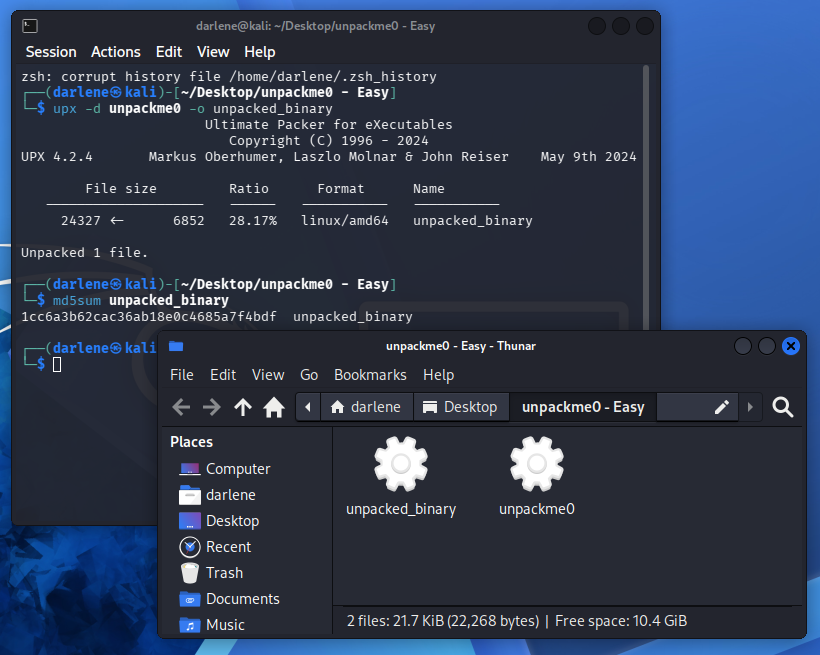
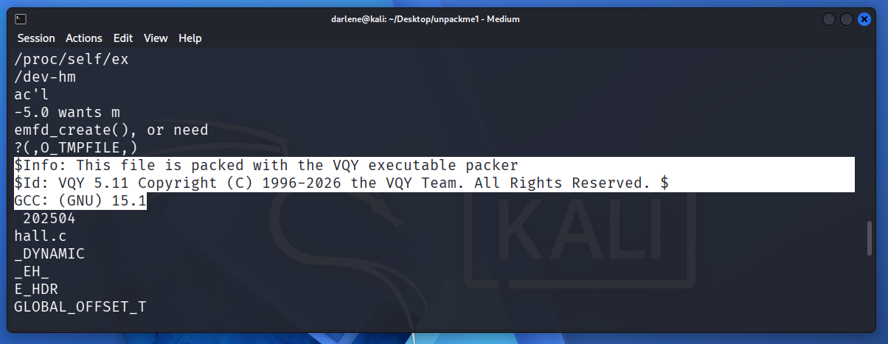
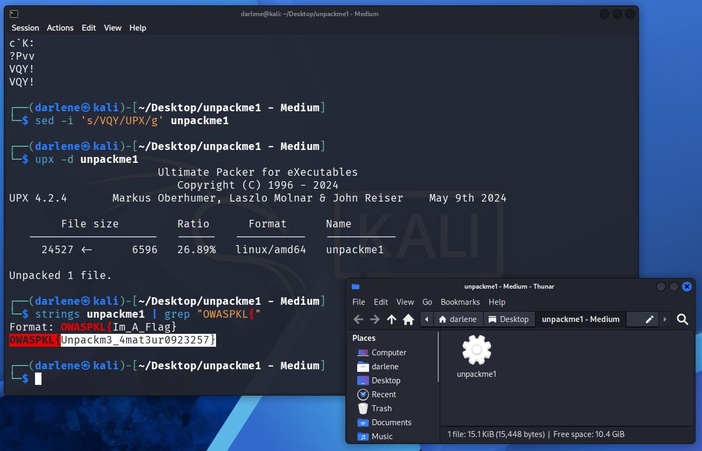
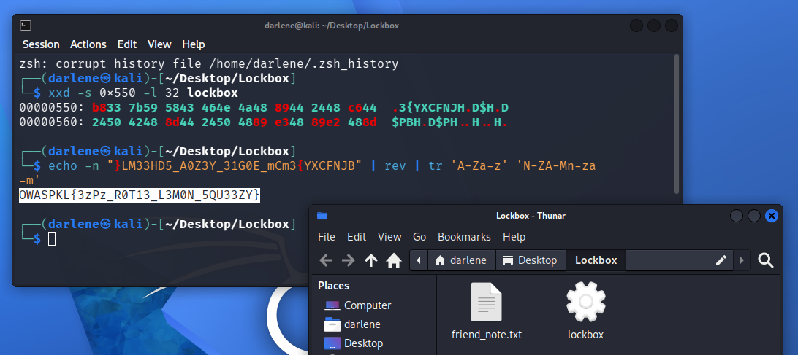

## Introduction 👋

[**LIGA CTF 2026**](https://appsecmy.com/pages/liga-ctf-2026) is a six-weekend, category-focused Capture The Flag (CTF) competition running from May to July 2026 organised by [**OWASP Malaysia Federation (Kuala Lumpur Chapter**)](https://appsecmy.com/). Each weekend focuses on a specific cybersecurity discipline, allowing participants to spend more time exploring a particular domain instead of handling multiple categories simultaneously.

I participated in this competition in [**Student Category**](https://ligactfstudent.appsecmy.com/) together with two other teammates. This write‑up covers the challenges I solved during **Week 1** of the competition and will serve as a personal reference for future practice.

**Week 1** focused on **Reverse Engineering** with some **Cryptography** elements, running from **22 May 2026, 08:00 PM** until **24 May 2026, 11:59 PM**. During this phase, I successfully solved 3 challenges.

> [!NOTE]+ 📢 Note
> I am still fairly new to writing formal CTF write‑ups, so I am actively working to improve my style and clarity. If you spot any mistakes or have suggestions, feel free to reach out.

---

## ⚔️ Logon Test

   

### 🗂️ Challenge Details



**Category: Free Point**

**Challenge: Logon Test**

This is to verify if you have successfully log in.

The flag format for this CTF can be one of the followings:
- liga{xxx}
- OWASPKL{xxx}
- ligactf{xxx}

Each challenge description will explicitly mention which flag format to use.

Submit OWASPKL{FR33_FL4G} to earn free point of this challenge.




```OWASPKL{FR33_FL4G}```



---

## ⚔️ CHALLENGE 1 -- unpackeme0 - Easy

   

### 🗂️ Challenge Details



**Category: Unpackme Series (Reverse Engineering)**

**Challenge: unpackeme0 - Easy**

Packing is a technique used by malware to obfuscate its functionalities. Malware packers 'pack' the main malicious binary to make static analysis much harder. The malware 'unpacks' during runtime. If this is your first time hearing about packers, it's recommended that you read this article first: https://medium.com/@shellseekerscyber/explainer-packed-malware-16f09cc75035   

With that out of the way, your first task is to identify the packer used for this binary, and unpack it. Provide the md5 hash of the unpacked file as your flag.

Example: ```OWASPKL{23ac7b66851387b96a20672b5c0dc856}```


  
<div></div>   



- Identify the packer used to obfuscate the binary.
- Unpack the binary to its original form.
- Compute the MD5 hash of the unpacked file. The hash is the flag.



```OWASPKL{1cc6a3b62cac36ab18e0c4685a7f4bdf}```



### 1️⃣ Identify the Packer   

I solved this challenge in Kali Linux virtual machine running on VirtualBox.   

The challenge description already indicates that the binary is packed, so the first step is to identify the packer being used.

**") 

I first analyzed the binary using **Detect It Easy (DIE)**. This tool is useful because it contains a large signature database and can often identify the exact packer and version used instead of providing only generic detections.

As shown in **Figure 1.1**, the binary is an **ELF64** executable packed using **UPX v5.11**.

### 2️⃣ Unpacking the Binary & Calculating the MD5 Hash

 

Since the binary is packed with UPX, we can easily unpack it using the `upx` utility with the `-d` (decompress) option as shown in **Figure 1.2**. To keep the original file untouched, the unpacked output is written to a separate file.   

```bash {lineNos=false hl_lines=[3,5,8] filename=Bash}
upx -d unpackme0 -o unpacked_binary
```  

Next, compute the MD5 hash of the unpacked binary.   

```bash {lineNos=false hl_lines=[3,5,8] filename=Bash}
md5sum unpacked_binary
```

As shown in **Figure 1.2**, the resulting MD5 hash is ```1cc6a3b62cac36ab18e0c4685a7f4bdf```. Therefore, the flag for this challenge is ```OWASPKL{1cc6a3b62cac36ab18e0c4685a7f4bdf}```.   


### ✅ Challenge Conclusion     

This challenge demonstrated how malware packers like UPX compress executables to hide their true contents. Using **Detect It Easy (DIE)** to identify the packer and a single command (`upx -d`) to reverse it showed that static analysis tools can quickly defeat simple packing. In real‑world malware analysis, packers are often the first layer of defense, and knowing how to recognize and unpack them is essential for triage and reverse engineering.

---

## ⚔️ CHALLENGE 2 -- unpackeme1 - Medium

   

### 🗂️ Challenge Details



**Category: Unpackme Series (Reverse Engineering)**

**Challenge: unpackeme1 - Medium**

Well done, by now you should hopefully understand more about packed binaries. Things won't be as straightforward anymore though. A simple anti unpacking technique was applied to this packed binary.

Your next task is the same: identify the packer used for this binary, and unpack it. Instead of getting the file hash, the flag is hidden in the unpacked file as a string.   

Format: ```OWASPKL{Im_A_Flag}```



<div></div>    



- Identify the packer and the anti-unpacking technique applied to the binary.
- Patch the binary headers to bypass the obfuscation.
- Unpack the binary to its original form.
- Extract the cleartext flag string from the unpacked binary.



```OWASPKL{Unpackm3_4mat3ur0923257}```



### 1️⃣ Identify the Anti-Unpacking Technique

I solved this challenge in Kali Linux virtual machine running on VirtualBox.  

Just like the first challenge, the binary is packed, but analyzing it reveals conflicting information. To investigate, we can use the `strings` command in Kali Linux to extract and examine the printable characters within the executable.

```bash {lineNos=false hl_lines=[3,5,8] filename=Bash}
strings unpackme1
```  

 

While scrolling through the output as shown in **Figure 2.1**, we can see standard UPX artifacts bleeding through, such as `UPX!8`.

 

However, despite the clear UPX artifacts, the strings output explicitly claims that `"$Info: This file is packed with the VQY executable packer"` as shown in **Figure 2.2**. Additionally, checking the end of the file shows the standard magic bytes have been altered to `VQY!`.

This indicates a simple anti-unpacking technique where the binary was packed with `UPX`, but the UPX magic bytes were manually modified to `VQY` in a hex editor to break automated analysis tools like `upx`.   

### 2️⃣ Patching & Unpacking the Binary   

 

To fix this, we need to revert the modified magic bytes back to their original state as shown in **Figure 2.3**. Since the replacement string `("VQY")` is the exact same length as the original `("UPX")`, we can seamlessly patch the binary directly from the terminal using `sed` command.   

```bash {lineNos=false hl_lines=[3,5,8] filename=Bash}
sed -i 's/VQY/UPX/g' unpackme1
``` 

Once the UPX headers are fully restored, the standard upx utility will recognize the file structure and decompress it successfully.

```bash {lineNos=false hl_lines=[3,5,8] filename=Bash}
upx -d unpackme1
```   

With the binary successfully unpacked, the memory and strings are no longer scrambled by compression. The challenge description states that the flag is hidden inside as a cleartext string.

We can easily extract it by dumping the readable text with `strings` again and piping the output into `grep` to isolate the flag format.

```bash {lineNos=false hl_lines=[3,5,8] filename=Bash}
strings unpackme1 | grep "OWASPKL{"
```

As shown in **Figure 2.3**, the output reveals the flag format and the final string. Therefore, the flag for this challenge is `OWASPKL{Unpackm3_4mat3ur0923257}`.

### ✅ Challenge Conclusion     

The twist here was a manual anti‑unpacking trick: changing the UPX magic bytes to `VQY` to break automated unpackers. The lesson is that signature‑based tools can be fooled by trivial hex edits, so an analyst must verify findings with raw data (e.g., `strings`) and be comfortable patching binaries. This technique mirrors real malware that tampers with headers to evade static unpacking, emphasizing the need to look beyond tool output.

---

## ⚔️ CHALLENGE 3 -- Lockbox

   

### 🗂️ Challenge Details



**Category: Reverse Engineering (Easy)**

**Challenge: Lockbox**

Your friend just got into learning Cryptography and is very proud of their first project. They built a program called `lockbox` that hides a secret message inside a binary, then sent it over with a note:

"i used THREE layers of protection — ROT13, reversed the string, and split the data into separate pieces scattered across memory. there's literally no way to get the message without the proper unlock code. try if you think you're so smart lol"

The only documented way to open it is `--unlock <code>`, and they never gave you the 64-character unlock code. Prove them wrong. Get the message.

Tip: Start with static analysis — run `strings` on the binary and compare what you find against what your friend claims is inside.

Flag format: `OWASPKL{...}`




<div> </div>  



- Identify the three layers of obfuscation (ROT13 → reverse → split).
- Locate the scattered string fragments inside the binary.
- Reassemble the pieces in correct memory order.
- Reverse the assembly and decode the ROT13 to reveal the flag.



```OWASPKL{3zPz_R0T13_L3M0N_5QU33ZY}```



### 1️⃣ Initial Reconnaissance & Static Analysis   

I solved this challenge in Kali Linux virtual machine running on VirtualBox.   


In **Figure 3.1**, the note `friend_note.txt` claims three layers which is **ROT13**, **reverse**, and **split into separate pieces scattered across memory**. If those are the only protections, then the original flag must still exist inside the binary as cleartext pieces (just transformed). Running `strings` command should reveal them immediately, despite the friend’s taunt.


As shown in **Figure 3.2**, We started by extracting strings, which instantly exposed four unusual fragments that did not look like normal binary strings:

```{lineNos=false hl_lines=[3,5,8] filename=Text}
}LM33HD5H
_A0Z3Y_3H
1G0E_mCmH
3{YXCFNJH
``` 

Each string is 9 characters long and ends with an uppercase `H`. The friend mentioned splitting the data into pieces, and these clearly look like parts of the transformed flag. The trailing `H` on every piece is suspicious which likely a decoy added to confuse simple strings output.   

### 2️⃣ Locating the Missing Piece     

The expected flag format is `OWASPKL{...}`, which is 8 characters for the prefix plus braces and leetspeak content. Four 9‑character pieces (after we strip the trailing `H`) give us four 8‑character chunks, totalling 32 bytes. But the fully decoded flag should be 32 characters as well? Actually, `OWASPKL{3zPz_R0T13_L3M0N_5QU33ZY}` has 33 characters. Wait – that’s 33. Let’s check: `OWASPKL{ = 8`, then `3zPz_R0T13_L3M0N_5QU33ZY = 24`, closing brace `} = 1` → total 33. Our four 8‑byte chunks = 32 bytes, missing one byte. Indeed, a single character must be stored separately.

Using `strings -n 1 -t x lockbox`, we printed every single character with its memory offset and searched for a lone `B` (since after reversal and ROT13, the first character of the original flag likely maps back to `B`). We found several `B` characters, but one occurred at offset `0x55b`, immediately after the last piece `3{YXCFNJH` (which ends at `0x55a`). This is our missing piece.

To be certain, we can dumped the raw bytes around that area:

```bash {lineNos=false hl_lines=[3,5,8] filename=Bash}
xxd -s 0x550 -l 32 lockbox
```

The hex dump confirmed the sequence `}LM33HD5H` ... `3{YXCFNJH` followed by `B` as a separate null-terminated string.

### 3️⃣ Reassembling & Decoding the Flag   

Now we had all five pieces in memory order:  

```{lineNos=false hl_lines=[3,5,8] filename=Text}
524 }LM33HD5H
533 _A0Z3Y_3H
542 1G0E_mCmH
551 3{YXCFNJH
55b B
```

Removing the decoy trailing `H` from the first four and appending the lone `B` gives the full transformed string:

```{lineNos=false hl_lines=[3,5,8] filename=Text}
}LM33HD5_A0Z3Y_31G0E_mCm3{YXCFNJB
```



As shown in **Figure 3.3**, to reverse the layers, first **reverse the whole string**, then **apply ROT13** (which is its own inverse).

```bash {lineNos=false hl_lines=[3,5,8] filename=Bash}
echo -n "}LM33HD5_A0Z3Y_31G0E_mCm3{YXCFNJB" | rev | tr 'A-Za-z' 'N-ZA-Mn-za-m'
```

The output will be `OWASPKL{3zPz_R0T13_L3M0N_5QU33ZY}`. The flag is a playful reference to ROT13 ("easy peasy ROT13 lemon squeezy").

### ✅ Challenge Conclusion     

This challenge taught that **simple obfuscation layers (ROT13, reverse, split‑and‑scatter) can still fool a lazy analyst**, but methodical string extraction and memory inspection defeat them. By combining `strings` with offset analysis, the scattered pieces were reassembled and decoded. In real‑world scenarios, malware often hides strings this way to avoid simple strings‑based IOC extraction, so the ability to reconstruct data from scattered fragments is a valuable reverse‑engineering skill.