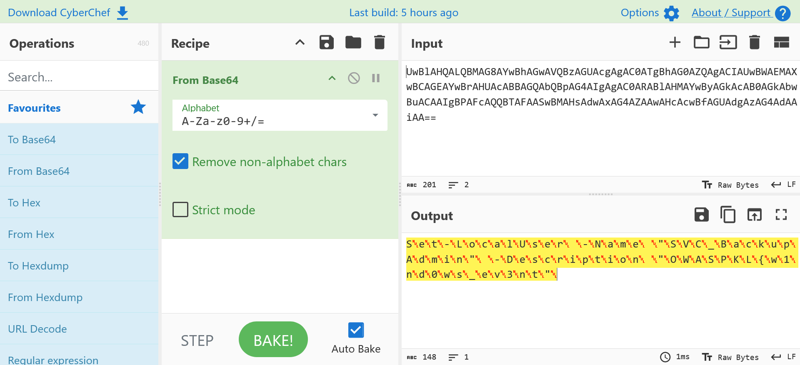
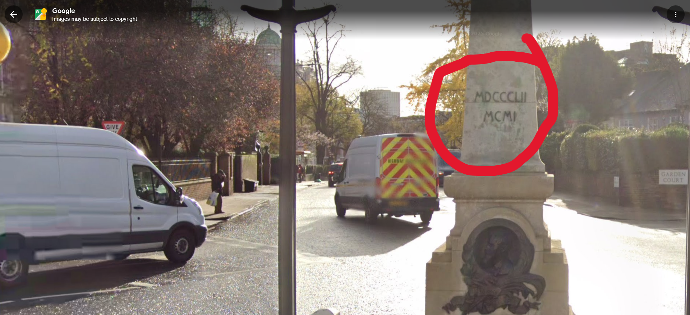

## Introduction 👋

[**LIGA CTF 2026**](https://appsecmy.com/pages/liga-ctf-2026) is a six-weekend, category-focused Capture The Flag (CTF) competition running from May to July 2026 organised by [**OWASP Malaysia Federation (Kuala Lumpur Chapter**)](https://appsecmy.com/). Each weekend focuses on a specific cybersecurity discipline, allowing participants to spend more time exploring a particular domain instead of handling multiple categories simultaneously.

I participated in this competition in [**Student Category**](https://ligactfstudent.appsecmy.com/) together with two other teammates. This write‑up covers the challenges I solved during **Week 3** of the competition and will serve as a personal reference for future practice.

**Week 3** focused on **Forensics, Log Analysis and OSINT**, running from **05 June 2026, 08:00 PM** until **07 June 2026, 11:59 PM**. During this phase, I successfully solved  7 challenges.

> [!NOTE]+ 📢 Note
> I am still fairly new to writing formal CTF write‑ups, so I am actively working to improve my style and clarity. If you spot any mistakes or have suggestions, feel free to reach out.

---

## ⚔️ Logon Test

   

### 🗂️ Challenge Details



**Category: Free Point**

**Challenge: Logon Test**

This is to verify if you have successfully log in.

The flag format for this CTF can be one of the followings:
- liga{xxx}
- OWASPKL{xxx}
- ligactf{xxx}

Each challenge description will explicitly mention which flag format to use.

Submit OWASPKL{FR33_FL4G} to earn free point of this challenge.




```OWASPKL{FR33_FL4G}```



---

## ⚔️ CHALLENGE 1 -- A bit to add

  

### 🗂️ Challenge Details



**Category: OSINT**

**Challenge: A bit to add**

We intercepted a shortlink passed between external entities. Your task is to track its digital footprint and find out when it was first generated.

The link is: bit.ly/4a6EzHh

Flag format example: OWASPKL{feb_02_2026}

---

INITIAL TIP: Start by exploring possible public metadata expansion paths.



- Understand how bit.ly shortlinks expose public metadata.
- Use the bit.ly statistics feature to view the link’s creation timestamp.
- Convert the UTC timestamp into the required date format.



```OWASPKL{may_27_2026}```



### 1️⃣ Understanding the Shortlink  

The challenge provides a **bit.ly** shortlink, `bit.ly/4a6EzHh`. **Bit.ly**, like many URL shorteners, offers a public statistics page for every shortened link. This page shows when the link was first created, how many clicks it has received, referrer data, and geographic information.

The trick is simple. Add a `+` to the end of any **bit.ly** URL to access its stats page.

### 2️⃣ Accessing the Statistics Page

  

We start by opening the stats URL [`https://bit.ly/4a6EzHh+`](https://bit.ly/4a6EzHh+) in a browser as shown in **Figure 1.1**. The page loads a Bit.ly informations showing:

| Field        | Value    |
|:-------------|:------------|
| Title        | My E-Business Card     |
| Shortlink    | `bit.ly/4a6EzHh`     |
| Destination  | `https://john-doe-elite-hacker.carrd.co/ `     |
| Created      | May 27 2026 06:14 UTC  |

### 3️⃣ Extracting and Formatting the Flag

The flag format example is `OWASPKL{feb_02_2026}`. From the stats page, `Month: May`, `Day: 27`, `Year: 2026`. Thus, the flag is `OWASPKL{may_27_2026}`

### ✅ Challenge Conclusion

This challenge reinforces a fundamental OSINT concept: public metadata exposure through URL shorteners. Many people assume a shortlink is just a redirect, but services like bit.ly intentionally provide analytics dashboards that leak the creation time, destination URL, and click statistics.

In a real‑world investigation, an analyst could use this technique to:
- Correlate the first appearance of a malicious link with other events.
- Determine if a link was generated before or after a known incident.
- Uncover the original destination even if the shortlink later changes (though not applicable here).

Always remember: a `+` can reveal more than you expect.

---

## ⚔️ CHALLENGE 2 -- Bay Watch

  

### 🗂️ Challenge Details



**Category: OSINT**

**Challenge: Bay Watch**

An environmental researcher dropped this image asset into a public repository before going off the grid. We need to identify the exact location of the turtle sanctuary shown in the image to verify their field deployment area.

Exclude words like "Turtle Sanctuary" from the actual flag.

Flag format example: OWASPKL{Location_Name}

---

INITIAL TIP: Start by performing a reverse-image or visual search on the distinct and unique features visible in the image.


  
<div></div>   



- Analyse visible clues from the provided image.
- Identify unique organisation logos and conservation programme references.
- Use OSINT searching to connect the image to a real-world turtle sanctuary.
- Extract the exact location name and format it according to the flag requirements.




```OWASPKL{Chagar_Hutang}```



### 1️⃣ Inspecting the Image  

 

As shown in **Figure 2.1**, The challenge provides an image of a large outdoor signboard placed in a coastal forest-like area. The signboard artwork shows a beach, sea, rocky cliffs, a boat, and a turtle crawling on sand. This strongly suggests that the image is related to a sea turtle nesting or conservation site.

The most useful OSINT clues are not the turtle drawing itself, but the logos printed at the top-right area of the signboard:
| Clue        | Observation    |
|:-------------|:------------|
| UMT        | Universiti Malaysia Terengganu     |
| MISC       | Malaysian maritime company     |
| Heart of the Ocean  | Marine biodiversity conservation programme     |
| PeTer      | Persatuan Pelukis Terengganu  |

At this point, the investigation direction becomes clear. The location is likely a turtle conservation site in **Terengganu, Malaysia**, connected to **UMT** and **MISC**.

### 2️⃣ Searching the Unique Visual Clues  

The initial tip suggests using reverse-image or visual search. However, the image also contains several searchable text clues. We can start searching through Google with keyword searches based on the unique logos and programme names shown in the image. In my case, I just search `UMT MISC Heart of the Ocean turtle sanctuary`.

 

As shown in **Figure 2.2** the Google Search result clearly shows **Chagar Hutang Turtle Sanctuary** and also leads to websites like [**SEATRU**](https://seatru.umt.edu.my/). **SEATRU** website shows that **Chagar Hutang Turtle Sanctuary** is a turtle sanctuary in Terengganu related to UMT. It is located at the northern part of Redang Island, which is the main landing place for Green and Hawksbill turtles.

### 3️⃣ Extracting and Formatting the Flag

The challenge specifically says to exclude words like "Turtle Sanctuary" from the actual flag, and the flag example is `OWASPKL{Location_Name}`. Therefore, the flag is `OWASPKL{Chagar_Hutang}`.

### ✅ Challenge Conclusion

This challenge demonstrates a common OSINT workflow using visual clues from an image. Instead of relying only on reverse-image search, the visible logos and text on the signboard provided strong searchable leads.

---

## ⚔️ CHALLENGE 3 -- The Ghost in the Logs

  

### 🗂️ Challenge Details



**Category: Forensics**

**Challenge: The Ghost in the Logs**

An alert was triggered for an unusual service account creation on a critical server. The attacker generated a massive amount of system noise to hide their tracks, utilizing obfuscated PowerShell scripts to split their credentials across multiple log locations.

Goal: Investigate the logs, find the rogue account, decode the attacker's commands, and reconstruct the full flag.

Initial Tip: Attackers often use Base64 to hide command arguments in process logs. Start by finding the anomaly, then pivot to process creation events.


  
<div></div>   



- Analyse the provided Windows Event Log file.
- Identify the suspicious account creation event.
- Investigate related PowerShell process execution logs.
- Decode any Base64-encoded PowerShell commands.
- Recover all flag fragments and reconstruct the complete flag.




```OWASPKL{w1nd0ws_ev3ntl0g_us3r_cr34t3d}```



### 1️⃣ Opening the Event Log File

The challenge provides a Windows Event Log file named `ghost_in_log.evtx`. Since the file uses the standard EVTX format, it can be opened directly using **Windows Event Viewer**.

The challenge description mentions a suspicious service account creation. Therefore, the first objective is to identify account creation events within the log file.  

### 2️⃣ Looking for Suspicious Account Creation Events

 

In Windows Security Logs, Event ID `4720` indicates that a user account has been created.

By filtering the log for Event ID `4720`, several account creation events become visible.

```{lineNos=false hl_lines=[3,5,8] filename=Text}
LocalAdmin_1
LocalAdmin_2
LocalAdmin_3
...
```

These accounts appear to have been intentionally created as noise to distract investigators.

However, one account stands out from the rest:

```{lineNos=false hl_lines=[3,5,8] filename=Text}
SVC_BackupAdmin
```

Unlike the other accounts, this account does not follow the same naming convention and appears to be the suspicious service account mentioned in the challenge description.

### 3️⃣ Pivoting to Process Creation Logs

 

The challenge hint mentions that the attacker used Base64-encoded PowerShell commands. In Windows Security Logs, process creation events are recorded under Event ID `4688`.

By filtering the log for Event ID 4688, several PowerShell execution events can be found.

Multiple entries contain the parameter:
```{lineNos=false hl_lines=[3,5,8] filename=Text}
-EncodedCommand
```

This is a common PowerShell technique used to obfuscate commands by encoding them in Base64 format.

Two Event ID `4688` entries contain the `-EncodedCommand` parameter:

```{lineNos=false hl_lines=[3,5,8] filename=Text}
Process Command Line:	"C:\Windows\System32\WindowsPowerShell\v1.0\powershell.exe" -EncodedCommand
UwBlAHQALQBMAG8AYwBhAGwAVQBzAGUAcgAgAC0ATgBhAG0AZQAgACIAUwBWAEMAXwBCAGEAYwBrAHUAcABBAGQAbQBpAG4AIgAgAC0ARABlAHMAYwByAGkAcAB0AGkAbwBuACAAIgBPAFcAQQBTAFAASwBMAHsAdwAxAG4AZAAwAHcAcwBfAGUAdgAzAG4AdAAiAA==
```

```{lineNos=false hl_lines=[3,5,8] filename=Text}
Process Command Line:	"C:\Windows\System32\WindowsPowerShell\v1.0\powershell.exe" -EncodedCommand
TgBlAHcALQBMAG8AYwBhAGwAVQBzAGUAcgAgAC0ATgBhAG0AZQAgACIAUwBWAEMAXwBCAGEAYwBrAHUAcABBAGQAbQBpAG4AIgAgAC0AUABhAHMAcwB3AG8AcgBkACAAKABDAG8AbgB2AGUAcgB0AFQAbwAtAFMAZQBjAHUAcgBlAFMAdAByAGkAbgBnACAAIgBsADAAZwBfAHUAcwAzAHIAXwBjAHIAMwA0AHQAMwBkAH0AIgAgAC0AQQBzAFAAbABhAGkAbgBUAGUAeAB0ACAALQBGAG8AcgBjAGUAKQA=
```

To determine what the attacker executed, both Base64 strings need to be decoded.

### 4️⃣ Decoding the PowerShell Command

 

From the two Event ID 4688 entries, we extracted the Base64-encoded strings and decoded them using [**CyberChef**](https://gchq.github.io/CyberChef/).

The decoded commands are:
```{lineNos=false hl_lines=[3,5,8] filename=Text}
Set-LocalUser -Name "SVC_BackupAdmin" -Description "OWASPKL{w1nd0ws_ev3nt"
New-LocalUser -Name "SVC_BackupAdmin" -Password (ConvertTo-SecureString "l0g_us3r_cr34t3d}" -AsPlainText -Force)
```

These commands reveal two separate flag fragments:
```{lineNos=false hl_lines=[3,5,8] filename=Text}
OWASPKL{w1nd0ws_ev3nt
l0g_us3r_cr34t3d}
```

At this point, we have all the pieces required to reconstruct the flag.

### 5️⃣ Reconstructing the Flag

The attacker split the flag across two different PowerShell commands. Combining both fragments which is `OWASPKL{w1nd0ws_ev3nt` + `l0g_us3r_cr34t3d}` produces `OWASPKL{w1nd0ws_ev3ntl0g_us3r_cr34t3d}`.

### ✅ Challenge Conclusion

This challenge demonstrates a common Windows forensic investigation workflow. Rather than searching directly for the flag, we first identified the anomalous account creation event, then pivoted to related process creation logs and decoded the Base64-obfuscated PowerShell commands.

The attacker attempted to hide their activity by generating numerous fake account creation events and splitting the flag across multiple log entries. By focusing on the suspicious service account and analysing the associated PowerShell activity, the complete flag was successfully reconstructed.

---

## ⚔️ CHALLENGE 4 -- The Artisan's Ledger

  

### 🗂️ Challenge Details



**Category: OSINT**

**Challenge: The Artisan's Ledger**

We recovered an image asset from an encrypted storage folder belonging to an international investigator. The image captures a section dedicated to a master artisan.

Your mission is to identify the whereabout of this image, locate the two Roman numeral year strings that appeared nearby, convert them to the modern decimal system, and find out the name of the sculpture that the nearby figure was based on.

Format the final flag by placing the smaller number first, then the bigger number second, and lastly followed by the name of the sculpture.

Flag format: OWASPKL{1667_1767_the_name_of_sculpture}

---

INITIAL TIP: Start by running a visual search of the image.


  
<div></div>   



- Perform a reverse image search on artisan.jpg to identify the real-world location.
- Locate the monument and find the two Roman numeral year strings.
- Convert the Roman numerals into the modern decimal system.
- Identify the original name of the sculpture that the nearby figure is based on.
- Assemble the flag using the converted dates and the sculpture's name.



```OWASPKL{1852_1901_the_muse_of_poetry}```



### 1️⃣ Running a Visual Search

 

The challenge provides an image file named `artisan.jpg`. The initial tip explicitly suggests running a visual search on the asset.

By uploading the image to a reverse image search engine like **Google Images**, we can look for visually similar architectural structures, plaques, or monuments.  

### 2️⃣ Identifying the Location  

 

As shown in **Figure 4.2**, The visual search results strongly match a specific monument located in London. The text and the unique stonework confirm that the image is a cropped section of the **Edward Onslow Ford Memorial**.

With the location identified, we can now pivot to **Google Maps Street View** to inspect the rest of the memorial.  

### 3️⃣ Extracting and Converting the Roman Numerals

 

As shown in **Figure 4.3**, by examining Google Maps Street View image of the monument, we can find the foundational dates inscribed on the stone. The two Roman numeral strings found are:

```{lineNos=false hl_lines=[3,5,8] filename=Text}
MDCCCLII
MCMI
```

To fulfill the challenge requirements, these need to be converted into the modern decimal system:
- **MDCCCLII:** `M (1000) + D (500) + CCC (300) + L (50) + II (2) = 1852`
- **MCMI:** `M (1000) + CM (900) + I (1) = 1901`

### 4️⃣ Identifying the Sculpture

The challenge also requires us to find the name of the sculpture that the nearby figure was based on. Looking at the front of the Edward Onslow Ford Memorial, there is a bronze seated mourning figure. Cross-referencing the monument's historical registry reveals that this bronze figure is a replica based on Ford's own earlier work.

The original sculpture is called [`The Muse of Poetry`](https://en.wikipedia.org/wiki/Edward_Onslow_Ford).

### 5️⃣ Reconstructing the Flag   

Now that we have all three components, we can format the final flag according to the challenge instructions: smaller number first, bigger number second, and the name of the sculpture (with spaces replaced by underscores).
- Smaller year: `1852`
- Bigger year: `1901`
- Sculpture: `the_muse_of_poetry`

Combining these elements gives us the final string which is `OWASPKL{1852_1901_the_muse_of_poetry}`.

### ✅ Challenge Conclusion

This challenge demonstrates a standard OSINT workflow combining visual reconnaissance with historical research. Rather than digging into file metadata, we used reverse image searching to identify a physical location from a tightly cropped photo.

By locating the Edward Onslow Ford Memorial, we were able to extract the hidden Roman numerals, convert them to standard dates, and use historical archives to identify the original "Muse of Poetry" sculpture, successfully recovering the flag.  

---

## ⚔️ CHALLENGE 5 -- Investigation - I

  

### 🗂️ Challenge Details



**Category: Malware Series - Forensics**

**Challenge: Investigation - I**

Remember The Art of Evasion challenge back in week 2?

Well it turns out, the VM image contained an active malware, specifically a C2 beacon.

In this series, your task is conduct a malware analysis to figure out what happened.

First, Identify, what was the stager file name? Flag format: OWASPKL{xxxx.exe}


  
<div></div>   



- Analyse the provided Windows Event Log file.
- Identify suspicious process execution activity.
- Trace the initial malware execution chain.
- Determine the malware stager filename.



`OWASPKL{phc.exe}`



### 1️⃣ Opening the Event Log File  

The challenge provides a Windows Event Log file named `dump.evtx`. Since the file uses the standard EVTX format, it can be opened using Windows Event Viewer.

The challenge description states that the virtual machine was infected with an active Command-and-Control (C2) beacon. Therefore, the investigation begins by identifying suspicious process execution events that may indicate malware activity.

### 2️⃣ Investigating Process Creation Events 

 

The log contains Sysmon Event ID `1`, which records process creation activities.

By reviewing recent process creation events, one entry immediately stands out:

```{lineNos=false hl_lines=[3,5,8] filename=Text}
2026-06-05 04:30:32.762
EV_RenderedValue_2.00
1136
C:\Users\ligac\Downloads\phc.exe
-
-
-
-
-
phc.exe  10424
C:\Users\ligac\Downloads\
DESKTOP-LGT6HFQ\ligac
EV_RenderedValue_13.00
2432265
1
Medium
MD5=8860ABA82B387B39E79A8C7FC43D42A6,SHA256=5D9F8486675F46DBC85FD4323F80C580D090BF16510762F0647B4A36F11BDD78,IMPHASH=6D7793E48A21560E731D6B5AE1D0433A
EV_RenderedValue_18.00
7032
C:\Windows\System32\cmd.exe
"C:\Windows\System32\cmd.exe" 
DESKTOP-LGT6HFQ\ligac
```

Unlike legitimate applications installed within the system, this executable was launched directly from the user's Downloads directory, which is a common location used by malware operators to execute payloads.

At this stage, `phc.exe` becomes the primary suspect.

### 3️⃣ Looking for Follow-Up Activity

After locating the suspicious executable, the next step is to investigate what happened immediately after its execution.

Several Sysmon events reveal that phc.exe created additional files:

```{lineNos=false hl_lines=[3,5,8] filename=Text}
C:\Users\ligac\AppData\Local\Temp\maindll.dll

C:\Users\ligac\AppData\Local\Microsoft\Windows\INetCache\IE\...\maindll[1].dll
```

The creation of DLL files shortly after execution is consistent with malware staging behaviour, where an initial executable drops secondary payloads onto the system.

### 4️⃣ Identifying Network Activity  

Further investigation shows DNS and network communication originating shortly after the execution of phc.exe.

A DNS query was observed:
```{lineNos=false hl_lines=[3,5,8] filename=Text}
appsecmy.3cc83feaa3b37384a190dd84b25a4592.xyz
```

Followed by an outbound network connection:
```{lineNos=false hl_lines=[3,5,8] filename=Text}
Destination IP: 104.21.54.36
Destination Port: 8443
```

This behaviour strongly indicates Command-and-Control (C2) communication, confirming that the executable is part of the malware infection chain.  

### 5️⃣ Identifying the Stager   

The challenge asks for the stager filename used by the threat actor.

Based on the evidence collected:
- `phc.exe` is the first suspicious executable launched.
- It executes from the Downloads directory.
- It creates additional DLL payloads.
- It initiates DNS lookups and outbound network communication.

These characteristics are consistent with a malware stager whose purpose is to establish persistence and load additional payloads.

Therefore, the stager filename is `phc.exe`. Thus the flag is `OWASPKL{phc.exe}`.

### ✅ Challenge Conclusion

This challenge demonstrates a typical malware triage workflow using Windows Event Logs. Rather than searching directly for the flag, we first identified suspicious process creation events, then correlated file creation and network activity associated with the executable.

The investigation revealed that phc.exe was responsible for dropping additional payloads and initiating communication with an external C2 server. These findings confirm that phc.exe was the malware stager used in the attack.   

## ⚔️ CHALLENGE 6 -- Investigation - II

  

### 🗂️ Challenge Details



**Category: Malware Series - Forensics**

**Challenge: Investigation - II**

What was the PID that the threat actor hijacked?

Flag format: OWASPKL{xxxx}



- Analyse process execution activity within the EVTX log.
- Identify the process targeted by the malware.
- Determine which process was hijacked by the threat actor.



`OWASPKL{10424}`



### 1️⃣ Reviewing the Malware Execution Chain

The second challenge uses the same `dump.evtx` file analysed in **Investigation - I**.

From the previous investigation, we identified a suspicious executable named `phc.exe` which was responsible for malware execution and subsequent C2 communication.

The next objective is to determine which process the malware hijacked.

### 2️⃣ Examining the Malware Command Line

Reviewing the Sysmon Event ID `1` entry for the malware reveals the following command line:

```{lineNos=false hl_lines=[3,5,8] filename=Text}
2026-06-05 04:30:32.762
EV_RenderedValue_2.00
1136
C:\Users\ligac\Downloads\phc.exe
-
-
-
-
-
phc.exe  10424
C:\Users\ligac\Downloads\
DESKTOP-LGT6HFQ\ligac
EV_RenderedValue_13.00
2432265
1
Medium
MD5=8860ABA82B387B39E79A8C7FC43D42A6,SHA256=5D9F8486675F46DBC85FD4323F80C580D090BF16510762F0647B4A36F11BDD78,IMPHASH=6D7793E48A21560E731D6B5AE1D0433A
EV_RenderedValue_18.00
7032
C:\Windows\System32\cmd.exe
"C:\Windows\System32\cmd.exe" 
DESKTOP-LGT6HFQ\ligac
```

The executable was launched with a single numeric argument: `10424`.

This value is highly suspicious because malware commonly accepts a Process ID (PID) as an argument when performing process injection or process hijacking.

### 3️⃣ Correlating Subsequent Activity

To verify whether `10424` represents a target process, the next step is to search for events associated with that PID.

Several events immediately appear under Process ID `10424`, including DNS requests and network activity.

One example is:

```{lineNos=false hl_lines=[3,5,8] filename=Text}
ProcessId: 10424

QueryName:
owaspkl.3cc83feaa3b37384a190dd84b25a4592.xyz
```

The fact that malicious DNS requests are originating from PID `10424` shortly after the execution of `phc.exe` strongly suggests that the malware injected itself into that process.

### 4️⃣ Identifying the Hijacked Process

Further review of the associated Sysmon events shows that Process ID `10424` was responsible for activity related to the malware beacon.

The attack sequence can therefore be summarised as follows:

```{lineNos=false hl_lines=[3,5,8] filename=Text}
phc.exe launched
      ↓
phc.exe receives argument 10424
      ↓
Malicious activity begins under PID 10424
      ↓
DNS and C2 communications observed
```

This correlation indicates that PID `10424` was the process selected by the malware for injection or hijacking.

### 5️⃣ Determining the Answer

The challenge asks for the PID that the threat actor hijacked.

Based on the process execution evidence and the subsequent malicious activity associated with that process, the hijacked PID is 10424. Thus, the flag is `OWASPKL{10424}`.

### ✅ Challenge Conclusion

This challenge focuses on identifying process injection behaviour using Sysmon logs. By analysing the command-line arguments supplied to the malware and correlating them with later DNS and network events, it becomes possible to identify the process that was targeted by the malware.

The evidence shows that `phc.exe` received `10424` as a process argument and that malicious activity subsequently originated from that same PID. Therefore, PID 10424 was the process hijacked by the threat actor.

---

## ⚔️ CHALLENGE 7 -- Investigation - III

  

### 🗂️ Challenge Details



**Category: Malware Series - Forensics**

**Challenge: Investigation - III**

What was the name of the process that was hijacked?

Flag format: OWASPKL{process.exe}



- Analyse process activity associated with the malware.
- Identify the process linked to the previously discovered PID.
- Determine the name of the process hijacked by the threat actor.



`OWASPKL{M365Copilot.exe}`



### 1️⃣ Reviewing Previous Findings

This challenge continues the investigation from **Investigation - I** and **Investigation - II**.

Previously, we identified:
- The malware stager as `phc.exe`.
- The hijacked Process ID (PID) as `10424`.

The next objective is to determine the name of the process associated with PID 10424.

### 2️⃣ Tracing Activity from the Hijacked PID

From the previous challenge, we observed that `phc.exe` was executed with the following command line:

```{lineNos=false hl_lines=[3,5,8] filename=Text}
phc.exe 10424
```

The argument `10424` was determined to be the PID targeted by the malware.

To identify the process name, the next step is to examine Sysmon events associated with PID `10424`.

### 3️⃣ Examining DNS activity

Filtering the log for events related to Process ID 10424 reveals several DNS queries generated shortly after the malware execution.

One of the entries contains the following information:

```{lineNos=false hl_lines=[3,5,8] filename=Text}
ProcessId: 10424

Image:
C:\Program Files\Microsoft Office\root\Office16\M365Copilot.exe

QueryName:
owaspkl.3cc83feaa3b37384a190dd84b25a4592.xyz
```

This event is particularly important because it shows both the Process ID and the executable responsible for generating the DNS request.  

### 4️⃣ Identifying the Hijacked Process

The process image associated with PID `10424` is:

M365Copilot.exe

```{lineNos=false hl_lines=[3,5,8] filename=Text}
M365Copilot.exe
```

Combining this with the findings from Investigation - II produces the following attack chain:

```{lineNos=false hl_lines=[3,5,8] filename=Text}
phc.exe launched
      ↓
phc.exe receives argument 10424
      ↓
PID 10424 belongs to M365Copilot.exe
      ↓
Malicious DNS activity observed
      ↓
C2 communication initiated
```

Since the malicious activity is being executed under the context of `M365Copilot.exe`, it is highly likely that the malware injected into or hijacked this process.

### 5️⃣ Determining the Answer

The challenge asks for the name of the process that was hijacked by the threat actor.

Based on the Sysmon logs, Process ID `10424` corresponds to `M365Copilot.exe`.

Therefore, the hijacked process is `M365Copilot.exe`. Thus, the flag is `OWASPKL{M365Copilot.exe}`.

### ✅ Challenge Conclusion

This challenge builds upon the findings from the previous investigations by linking the hijacked PID to its corresponding executable. Through analysis of Sysmon DNS events, it was possible to identify the process image associated with PID `10424`.

The evidence shows that malicious DNS queries and subsequent C2 communications originated from `M365Copilot.exe`, indicating that this process was hijacked by the malware. By correlating process creation events with later network activity, the name of the compromised process was successfully identified.